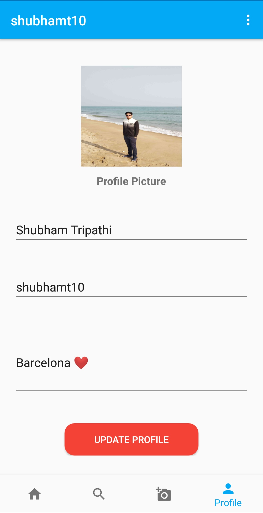

# Snapster
This is an image sharing app , essentially an instagram clone . This app uses firebase as backend. 

# Technologies Used

Android Studio

JAVA

XML

Firebase

# Backend

Firebase : https://firebase.google.com

# Screenshots

## Wall

## Profile

## Add Image

## Search

## User

## Edit Profile

